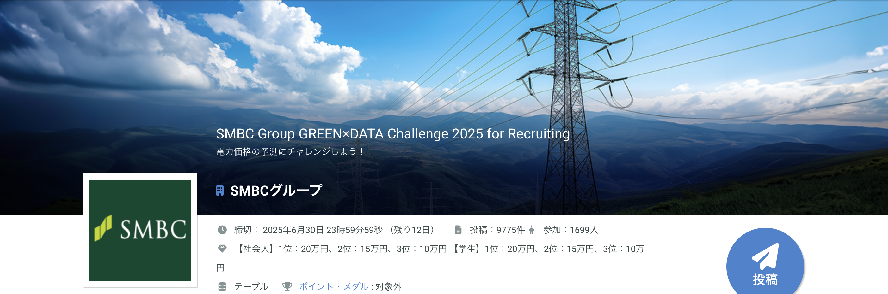

# SIGNATE-SMBC-Group-Challenge-2025
SIGNATE-SMBC-Group-Challenge-2025　コンペのリポジトリ

- directory tree
```
SIGNATE-SMBC-Group-Challenge-2025
├── README.md
├── data         <---- gitで管理するデータ
├── data_ignore  <---- .gitignoreに記述されているディレクトリ(モデルとか、特徴量とか、データセットとか)
├── nb           <---- jupyter notebook で作業したノートブック
├── nb_download  <---- 参考にしたノートブック
```

## Dataset
|Name|Detail|Ref|
|---|---|---|
|name|detail|[xxx](xxx)|

## Event
|Name|Detail|Ref|
|---|---|---|
|name|detail|[xxx](xxx)|

## Features
|Name|shape (feat only)|size(MB)|Detail|
|---|---|---|---|
|xxx.csv|(21,375, 11)|2.0|xxx|

## Paper
|No.|Status|Name|Detail|Date|Url|
|---|---|---|---|---|---|
|01|<font color='gray'>Done/Doing/Todo</font>|Name|Detail|year|[url](xx)|


## Log
### 20250618
- join
- 残り12日の状態で参加。大分遅れをとっている。。。
 - データコンペで最後まで走り抜けた記憶が無いため、日記をつけながらなんとか感想したい。
 - 参考：[Kaggle日記という戦い方](https://zenn.dev/fkubota/articles/3d8afb0e919b555ef068)
